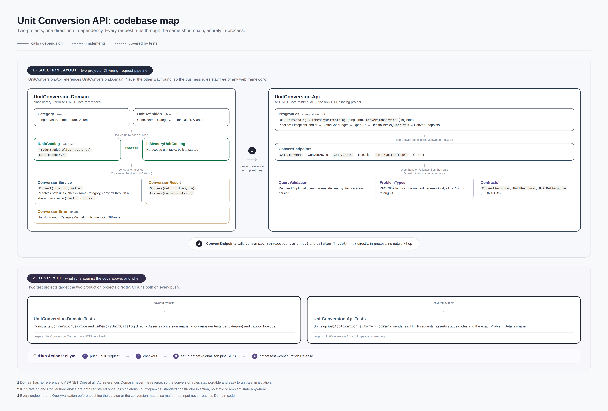

# Unit Conversion API

HTTP API for converting a value from one unit to another in the same physical category. I built it as a small ASP.NET Core service with the conversion math isolated from HTTP, because those two things change for different reasons.

Supported categories:

- **Length**, international foot/yard/mile (not US survey).
- **Mass**, avoirdupois pound and ounce.
- **Temperature**, kelvin / Celsius / Fahrenheit.
- **Volume**, litre / millilitre / US liquid gallon (`gal_us`). There is no bare `gal` or `gallon` alias; US and imperial gallons differ, so the code stays explicit.

Canonical codes are case-sensitive (`km` works, `KM` does not). Word aliases like `metre`, `METRE`, `pound`, `us-gallon` are case-insensitive.

## Prerequisites

- .NET SDK **10.0.401** or a later 10.0 feature-band build. `global.json` pins `10.0.401` with `rollForward: latestFeature`.
- Install from [https://dotnet.microsoft.com/download](https://dotnet.microsoft.com/download) (macOS or Windows).
- Confirm in a terminal (**Terminal** on macOS, **PowerShell** or **Command Prompt** on Windows):

```bash
dotnet --list-sdks
```

I did not add Docker. For this size of service a local `dotnet run` is enough; an image would need a verified build and smoke path before I would document it.

## Run

Open a terminal at the repository root, then:

**macOS / Linux (bash or zsh):**

```bash
dotnet test --configuration Release --nologo
dotnet run --project src/UnitConversion.Api --launch-profile http
```

**Windows (PowerShell or Command Prompt):**

```powershell
dotnet test --configuration Release --nologo
dotnet run --project src/UnitConversion.Api --launch-profile http
```

The `http` profile listens on **[http://localhost:5080](http://localhost:5080)** on both platforms. Leave that terminal open while you try the URLs below or Postman.

## Postman

There is a ready-made collection and environment under `postman/`. They cover health, OpenAPI, unit listing and lookups (every code and word alias), every same-category conversion pair with two sample values, and a few documented error cases.

Import **both** files:

1. `postman/UnitConversion.postman_collection.json`
2. `postman/UnitConversion.postman_environment.json`

In Postman: **Import** → select both files (or drop the `postman/` folder). Then, in the environment picker (top right), choose **Unit Conversion API — local http**. Start the API with the `http` profile first so `baseUrl` is `http://localhost:5080`.

Collection / environment variables (change these once; every convert request uses them):


| Variable                                  | Default                 | Used for          |
| ----------------------------------------- | ----------------------- | ----------------- |
| `baseUrl`                                 | `http://localhost:5080` | All requests      |
| `lengthValue1` / `lengthValue2`           | `1` / `2.5`             | Length pairs      |
| `massValue1` / `massValue2`               | `1` / `16`              | Mass pairs        |
| `temperatureValue1` / `temperatureValue2` | `0` / `32`              | Temperature pairs |
| `volumeValue1` / `volumeValue2`           | `1` / `3.785411784`     | Volume pairs      |


Run a folder (for example **Convert → Length**) with Collection Runner if you want every pair in one go.

## Examples

With the API running, open these URLs in a browser (or paste them into Postman). They work the same on macOS and Windows.


| What                          | URL                                                                                                                            |
| ----------------------------- | ------------------------------------------------------------------------------------------------------------------------------ |
| 0 °C to kelvin                | [http://localhost:5080/api/v1/convert?from=degC&to=K&value=0](http://localhost:5080/api/v1/convert?from=degC&to=K&value=0)     |
| Inch to metre (NIST 0.0254)   | [http://localhost:5080/api/v1/convert?from=in&to=m&value=1](http://localhost:5080/api/v1/convert?from=in&to=m&value=1)         |
| Word alias (`metre`)          | [http://localhost:5080/api/v1/convert?from=metre&to=cm&value=2](http://localhost:5080/api/v1/convert?from=metre&to=cm&value=2) |
| Leading plus encoded as `%2B` | [http://localhost:5080/api/v1/convert?from=m&to=m&value=%2B1](http://localhost:5080/api/v1/convert?from=m&to=m&value=%2B1)     |
| All units                     | [http://localhost:5080/api/v1/units](http://localhost:5080/api/v1/units)                                                       |
| Volume units only             | [http://localhost:5080/api/v1/units?category=volume](http://localhost:5080/api/v1/units?category=volume)                       |
| One unit (`gal_us`)           | [http://localhost:5080/api/v1/units/gal_us](http://localhost:5080/api/v1/units/gal_us)                                         |
| Category mismatch (error)     | [http://localhost:5080/api/v1/convert?from=m&to=kg&value=1](http://localhost:5080/api/v1/convert?from=m&to=kg&value=1)         |
| Unknown unit (404)            | [http://localhost:5080/api/v1/units/nope](http://localhost:5080/api/v1/units/nope)                                             |
| Health                        | [http://localhost:5080/health](http://localhost:5080/health)                                                                   |
| OpenAPI                       | [http://localhost:5080/openapi/v1.json](http://localhost:5080/openapi/v1.json)                                                 |


Successful convert payload looks like:

```json
{
  "value": 273.15,
  "from": { "code": "degC", "category": "temperature" },
  "to": { "code": "K", "category": "temperature" },
  "input": 0
}
```

`from` / `to` are the resolved canonical codes. Factors and offsets stay internal.

## HTTP contract


| Method | Path                   | Notes                                                                             |
| ------ | ---------------------- | --------------------------------------------------------------------------------- |
| GET    | `/api/v1/convert`      | Query: `from`, `to`, `value` (each exactly once)                                  |
| GET    | `/api/v1/units`        | Optional `category` (`length`, `mass`, `temperature`, `volume`, case-insensitive) |
| GET    | `/api/v1/units/{code}` | Code or word alias                                                                |
| GET    | `/health`              | `200` plaintext `Healthy`                                                         |
| GET    | `/openapi/v1.json`     | Built-in OpenAPI                                                                  |


`value` grammar: optional `+`/`-`, one or more digits, optional `.` plus more digits. No thousands separators, exponents, `NaN`, or `Infinity`. A literal `+` in the query string is `+` as space unless you send `%2B`.

Parse uses invariant culture. If the token is in range but cannot be represented exactly as `decimal` (too many significant digits), the API returns `numeric-out-of-range` rather than silently rounding the input.

Results retain native `decimal` precision; clients may round for display. Some Fahrenheit results look like `32.000…001` because `5/9` is not a terminating decimal.

Signed values are accepted in every category, including temperatures below 0 K. This service does unit arithmetic, not physics admissibility.

`decimal` can also underflow tiny nonzero results to zero. That is native .NET behavior, not a second rounding step.

Errors are RFC 7807 Problem Details (`application/problem+json`) with `status`, `title`, `type`, and extension `code`.


| Situation                                                                | Status | `code`                 | `type`                                            |
| ------------------------------------------------------------------------ | ------ | ---------------------- | ------------------------------------------------- |
| Missing / empty / repeated query, bad number syntax, bad category filter | 400    | `validation-error`     | `urn:unitconversion:problem:validation-error`     |
| Input not exact in decimal, or conversion overflow                       | 400    | `numeric-out-of-range` | `urn:unitconversion:problem:numeric-out-of-range` |
| Unknown `from` / `to` on convert                                         | 400    | `unit-not-found`       | `urn:unitconversion:problem:unit-not-found`       |
| Different categories                                                     | 400    | `category-mismatch`    | `urn:unitconversion:problem:category-mismatch`    |
| Unknown unit on `/units/{code}`                                          | 404    | `unit-not-found`       | `urn:unitconversion:problem:unit-not-found`       |
| Unhandled exception                                                      | 500    | `internal-error`       | `urn:unitconversion:problem:internal-error`       |


500 responses include a trace id and a generic message. They do not include stack traces or exception text, in Development or Production.

Validation order on convert: query shape and number → source lookup → destination lookup → category → arithmetic.

## Design

Conversion is an affine map through a canonical base per category:

```text
toBase = value * from.Factor + from.Offset
output = (toBase - to.Offset) / to.Factor
```

That is enough for SI-style scaling and for Celsius/Fahrenheit offsets. I did not build a unit graph or BFS; with a closed catalog this size, a direct map through a canonical base is simpler and sufficient.

If the resolved source and destination are the same unit, I return the input as-is. Running max `decimal` through the base and back is a good way to overflow for no reason.

The catalog is hardcoded, immutable, and validated when `InMemoryUnitCatalog` is constructed. The host resolves `IUnitCatalog` at startup so a bad catalog never starts listening. `IUnitCatalog` exists so tests can swap in another catalog (there is a furlong fixture that uses the same `ConversionService`). Adding a real unit is a data change: factor from a cited NIST/SI source, aliases that do not collide with codes, and tests whose expected values are **not** copied out of the catalog under test.

HTTP lives in `UnitConversion.Api`. Domain lives in `UnitConversion.Domain`. Query parsing is explicit in the API because framework model binding would hide duplicate keys and the exact lexical rules I wanted.

Layout:

```text
src/UnitConversion.Domain/   conversion + catalog
src/UnitConversion.Api/      Minimal APIs
tests/…                      xUnit (domain + WebApplicationFactory)
postman/                     Postman collection + local environment
```

## Diagram

Two projects, one direction of dependency. Domain has no ASP.NET types; the API project is the only HTTP surface. Every request is validated, then converted in-process — no extra hop.



The map is the same story as the folders above: `ConversionService` and `InMemoryUnitCatalog` live in Domain; `ConvertEndpoints` calls them after `QueryValidation`. Domain tests hit the catalog and conversion math directly. API tests host the app in memory and assert status codes and Problem Details.


## Why these choices

**Hardcoded catalog.** The set of units is small and stable. A database or config file would mean migrations, caching, and a worse story for "did this factor change." If the catalog ever needs to be edited at runtime, that is a product requirement, not something I should invent now.

`decimal` **instead of** `double`**.** Conversion factors like 0.0254 and 0.45359237 are decimal by construction. `double` would introduce binary rounding on values people expect to be exact. `decimal` is slower and has a smaller exponent range. For an API that converts a handful of numbers per request, I will take the slower type.

**GET, not POST.** A conversion is a pure function of three query parameters. GET is cacheable, easy to curl, and matches how people actually try the API. POST would make sense for a batch body. I did not add batching.

**Minimal APIs, not controllers.** There are three routes. Controllers would add files without adding behavior. I also skipped extra layers (mediators, generic repositories). Four projects is already enough split: domain, host, two test assemblies.

**No extra rounding on output.** Results retain native `decimal` precision; clients may round for display. Intermediate overflow is reported as 400 even if a different algebraic form might have succeeded. I am not rewriting expressions per unit.

**No auth, rate limits, or pagination.** Nothing here is user-specific or large. Those belong when there is a real client and a real threat model.

## Tests

```bash
dotnet test --configuration Release --nologo
```

What I cared about:

- Known answers from NIST/SI (inch, pound, US gallon, SI prefixes), not from reading `Factor` off the catalog.
- Identity, overflow, underflow, negative kelvin.
- Catalog construction rejects collisions, padded codes, and non-identity bases.
- HTTP: query cardinality, number grammar, Problem Details `type`/`code`, Accept headers, 500 without leaking internals, invalid catalog fails startup.

CI is GitHub Actions: install the SDK from `global.json`, then `dotnet test --configuration Release`.

## Adding a unit

1. Add the `UnitDefinition` with a source URL next to the factor.
2. Do not invent unqualified aliases that hide regional variants.
3. Add an independent known-answer test and, if it is a new category, extend `Category` and the HTTP filter list.

That is the whole extension story. An unused interface does not by itself prove extensibility; the furlong test fixture does, by exercising the same `ConversionService` against a different catalog.